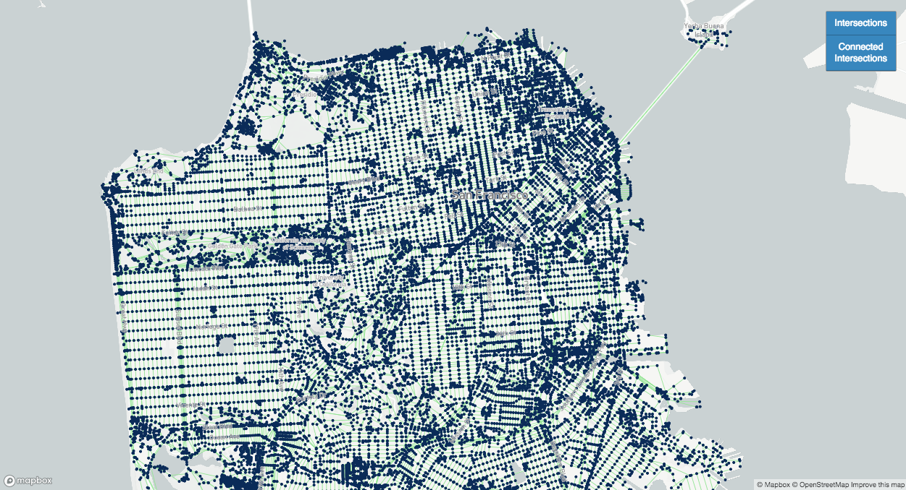
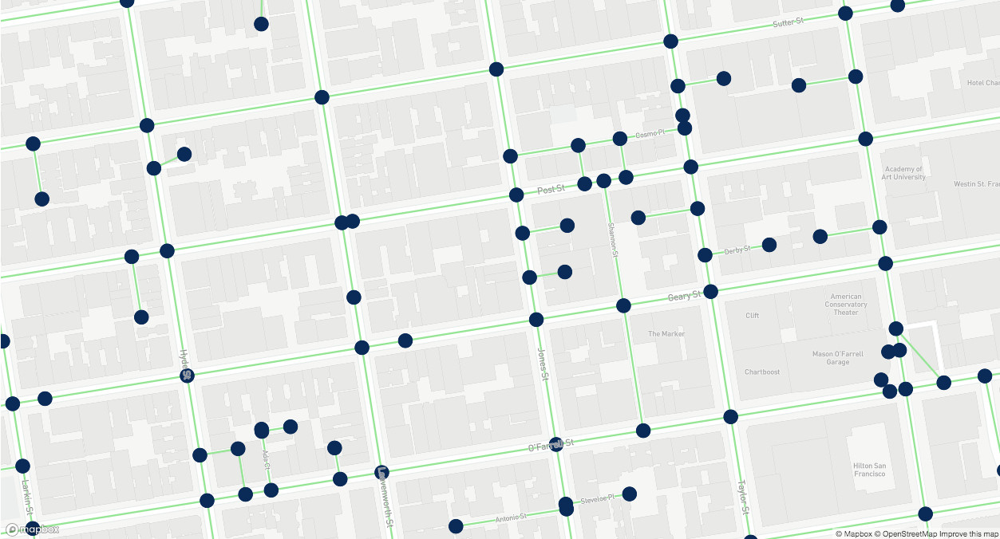
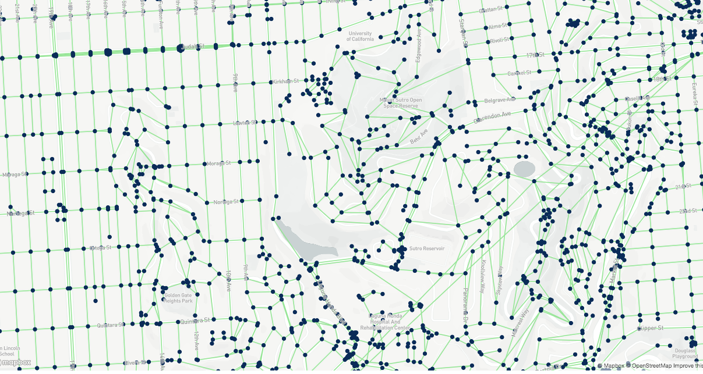

# Road Network API

Road Network API constructs intelligent networks out of city road systems and exposes them as publicly available JSON collections. This API is intended to provide other developers a platform upon which to build their own custom path finding algorithms, road traversal logic, or for use in other analytical purposes -- without the work of constructing the road networks from scratch.

The datasets are based on the connections between shared points in road geometry compiled by [Open Street Maps](https://www.openstreetmap.org). These shared points represent intersections, which this API constructs into a [graph](https://en.wikipedia.org/wiki/Graph_theory) by connecting each intersection to all of its adjacent intersections. Currently only data on San Francisco streets are loaded into the database, though the project is ongoing and contributions or pull requests are welcome.


*Example visualization of the API data overlaid atop a San Francisco map. Intersections are dark blue and the connections between them are green.*

    

## API Endpoints

There are currently two endpoints exposed:
+ `http://road-network-api.herokuapp.com/intersections` returns a JSON array of `intersections`.
+ `http://road-network-api.herokuapp.com/road_edges` returns a JSON array of `road_edges`.

**Note that each of the above endpoints takes one parameter, an integer `$offset`, which corresponds to SQL's OFFSET command. This is due to the fact that each call returns a maximum of 5,000 rows for performance reasons.**

Example using jQuery's [$.ajax method](http://api.jquery.com/jquery.ajax/):

````javascript
$.ajax({
    url: 'http://road-network-api.herokuapp.com/intersections',
    data: {
      '$offset': 5000
    }
  })

// Returns:
// [
  // {
  //   "id": 5001,
  //   "latitude": "37.727738",
  //   "longitude": "-122.463601"
  // },
  // {
  //   "id": 5002,
  //   "latitude": "37.728234",
  //   "longitude": "-122.463943"
  // },
  // {
  //   "id": 5003,
  //   "latitude": "37.709892",
  //   "longitude": "-122.456826"
  // } ...
// ]
````

## Constructing the Road Network

The logic that constructs these road networks is based on a fundamental principle: that any two roads that intersect will share at least one exact geographic coordinate. Open Street Maps abides by [this principle](http://wiki.openstreetmap.org/wiki/Node#Nodes_on_Ways). Therefore, intersections may be extracted from a city's road system by finding the coordinates that appear more than once (i.e. the point is shared by two different roads).

````ruby
# Finding intersections in San Francisco, from an Open Street Maps GeoJSON file
file = File.read('san-francisco_california_roads.geojson')
roads = JSON.parse(file)['features']

# Initialize hash to count how many times each coordinate appears, with a default value of 0 for each coordinate
coord_frequencies = Hash.new { |hash, key| hash[key] = 0 }

roads.each do |road|
  road['geometry']['coordinates'].each do |coord|
    coord_frequencies[coord.to_s] += 1
  end

  # Add 1 to start point and end point of each road, so that they will be counted as intersections
  road_start = road['geometry']['coordinates'].first
  road_end = road['geometry']['coordinates'].last
  [road_start, road_end].each { |coord| coord_frequencies[coord.to_s] += 1 }
end

# Finally, extract all coordinates that appeared more than once
intersections = coord_frequencies.select { |_, frequency| frequency > 1 }.keys
````

### Connecting Adjacent Intersections

Two intersections should be connected if and only if the following two conditions are met:
  1. They share the same road.
  2. There are no other intersections along that road between them. Only intersections that are immediately adjacent to one another should be connected.

In order to connect appropriate intersections, iterate over each road's list of coordinates and check whether that coordinate is an intersection. If it is, then connect it to the **previous** intersection that you found on that road.

````ruby
# Example using Open Street Maps GeoJSON file
file = File.read('san-francisco_california_roads.geojson')
roads = JSON.parse(file)['features']

roads.each do |road|
  prev_intersection = nil
  road['geometry']['coordinates'].each do |longitude, latitude|
    # A separate is_intersection? helper method was implemented to deal with nuanced comparisons of BigDecimal types
    if is_intersection?(latitude, longitude)
      this_intersection = Intersection.where(latitude: latitude, longitude: longitude).first
      # Special condition in the case that the first coordinate on the road is an intersection, i.e. there is not yet any prev_intersection
      if prev_intersection
        RoadEdge.create!(
          intersection1_id: prev_intersection.id,
          intersection2_id: this_intersection.id,
          street_name: road['properties']['name']
        )
      end
      # Save this intersections as the new previous intersection
      prev_intersection = this_intersection
    end
  end
end
````

## Database Schema

The [database](./db/schema.rb) consists of three tables: `intersections`, `road_edges`, and `road_points`. The schema for each table is as follows:

````ruby
# Table name: intersections
# =========================
#  id        :integer          not null, primary key
#  latitude  :decimal(10, 6)   not null
#  longitude :decimal(10, 6)   not null

# Table name: road_edges
# =========================
#  id               :integer          not null, primary key
#  intersection1_id :integer          not null
#  intersection2_id :integer          not null
#  street_name      :string

# Table name: road_points
# =========================
#  id           :integer          not null, primary key
#  latitude     :decimal(10, 6)   not null
#  longitude    :decimal(10, 6)   not null
#  road_edge_id :integer          not null
````
